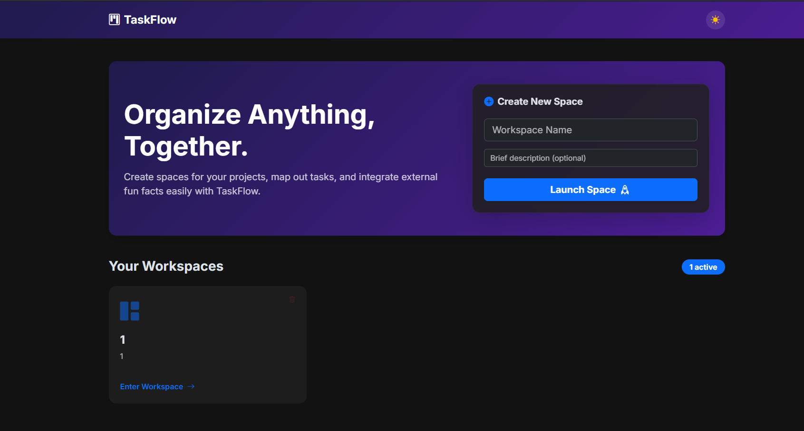
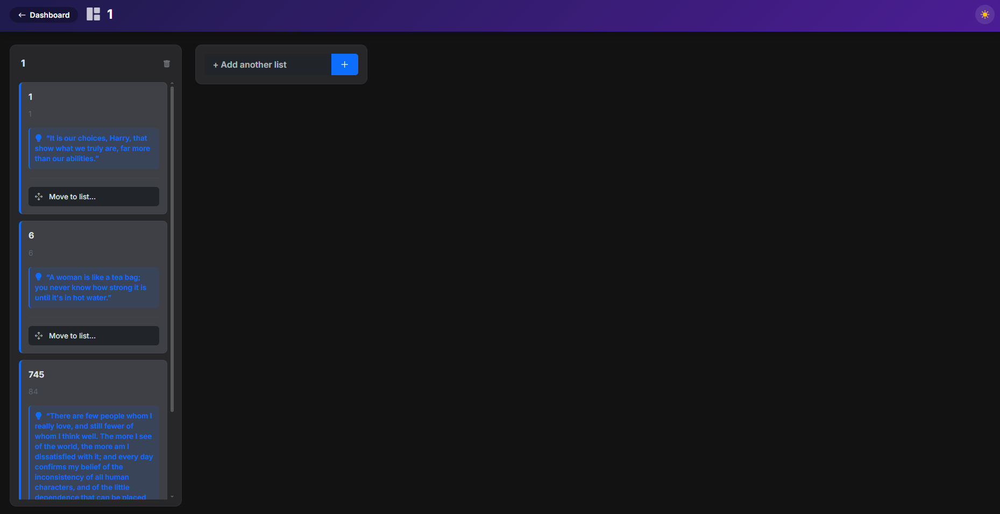
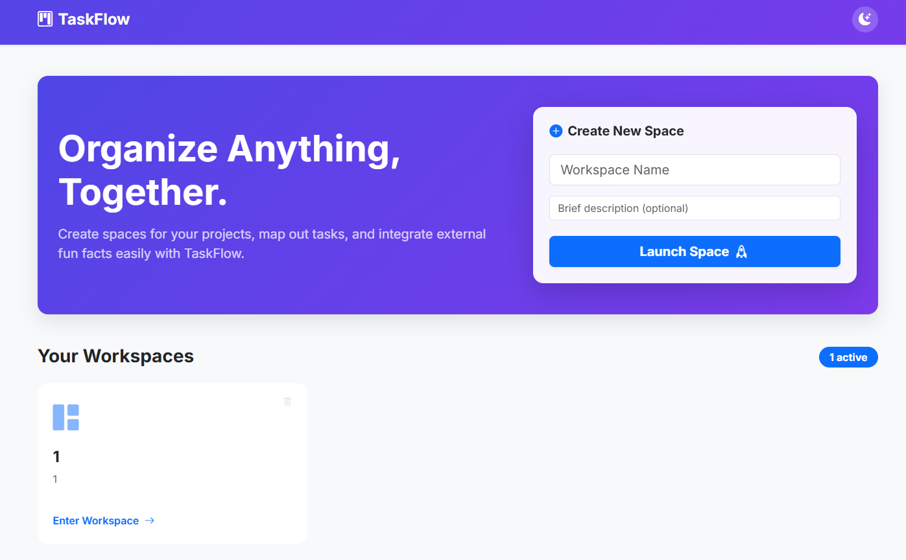
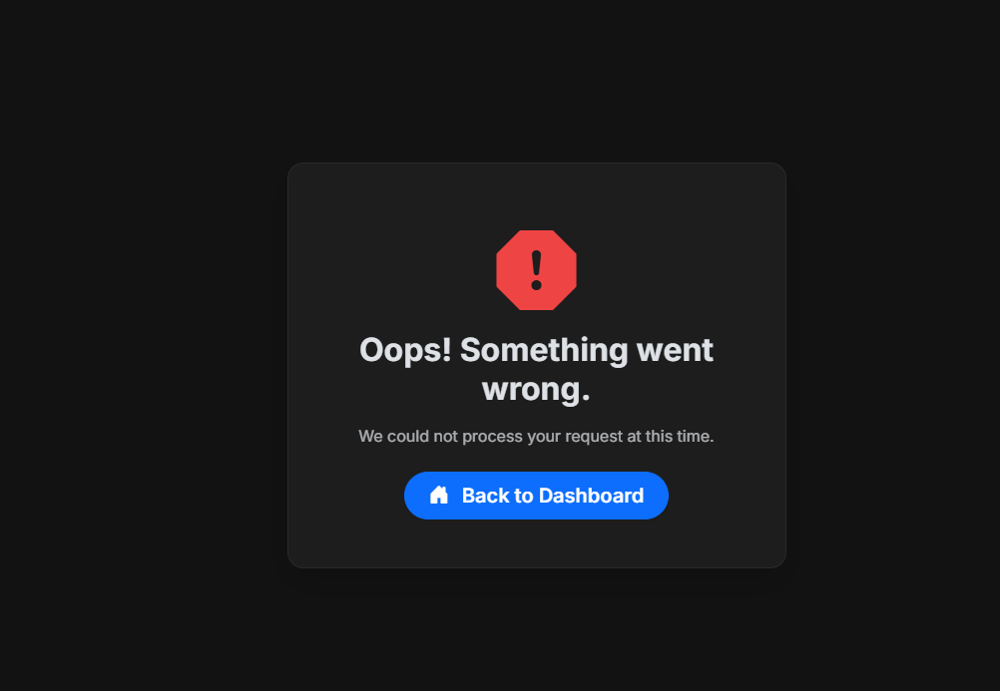

**Task Manager (Mini Trello)** is a web application for organizing workflows, creating boards, lists, and dragging tasks between them. 
Designed with a modern Glassmorphism UI and a functional Drag-and-Drop capability.
RAILWAY TEST HOST(TRIAL) [javaup-production.up.railway.app](https://javaup-production.up.railway.app)

---

## 📸 Screenshots
| Main Dashboard (Boards) | Board View (Lists & Tasks) |
|-------------------------|----------------------------|
| | |

| White Theme | Error Page (Global Handler) |
|------------|-----------------------------|
| | |

---

## ✨ Features
- **Workspaces (Boards)** — creating, viewing, and deleting customized project boards.
- **Lists (Columns)** — creating columns to organize different task states (e.g., To Do, In Progress, Done).
- **Drag & Drop** — interactive reordering of Lists with immediate position saving to the database via async fetch API.
- **Task Management** — creating tasks, moving them between columns, and deleting them.
- **Dynamic Quotes Integration (Jsoup)** — each newly created task automatically fetches a random fun fact/quote by parsing an external website.
- **Exception Handling** — centralized global error handling bypassing the default "Whitelabel" error page.
- **Theme Switcher** — toggle between Light and Dark mode with preferences saved in the browser's `localStorage`.

---

## 🛠 Tech Stack

### Backend
| Technology | Version | Description |
|-----------|----------|-------------|
| Java | 17 / 21 | Primary Language |
| Spring Boot | 3.5.11 | Application Framework |
| Spring MVC | 6.x | HTTP Request Handling |
| Spring Data JPA | 3.x | Database Access |
| Hibernate | 6.x | Object-Relational Mapping (ORM) |
| Jsoup | 1.17.2 | External HTML Parsing (for fun facts) |
| Lombok | 1.18.36 | Boilerplate Code Reduction |

### Frontend
| Technology | Description |
|-----------|-------------|
| Thymeleaf | Server-side templating engine |
| Bootstrap 5.3 | Responsive UI components & layout |
| Vanilla JavaScript | Client-side logic & event handling |
| SortableJS | Drag-and-drop capability for lists |
| Custom CSS | Glassmorphism design and animations |

### Database & Tools
| Tool | Description |
|-----------|-------------|
| H2 Database | Embedded file-based database (Zero setup) |
| Maven | Project build & dependency management |

---

## 🚀 Getting Started

### 1. Clone the repository
```bash
git clone https://github.com/your-username/TaskManager.git
cd TaskManager
```

### 2. Launch the application
You can run the application directly from your IDE (execute the `TaskManagerApplication.java` main method) or use the Maven wrapper:
```bash
mvn spring-boot:run
```

The application will launch automatically and establish a local H2 database file.

### 3. Open in Browser
Open your browser and navigate to:
**http://localhost:8080**

To view the database directly via the H2 Console, navigate to `http://localhost:8080/h2-console` and connect using `jdbc:h2:file:./data/taskdb` with the username `sa` (no password).

---

## 🏗 Architecture
The application strictly follows a Layered MVC Architecture:
- `com.taskmanager.app.entity` — Database mappings.
- `com.taskmanager.app.repository` — Data Access using `JpaRepository`.
- `com.taskmanager.app.service` — Business logic (managing entities and interacting with external APIs via Jsoup).
- `com.taskmanager.app.controller` — Routing logic mapping user HTTP requests to the corresponding Thymeleaf views.
